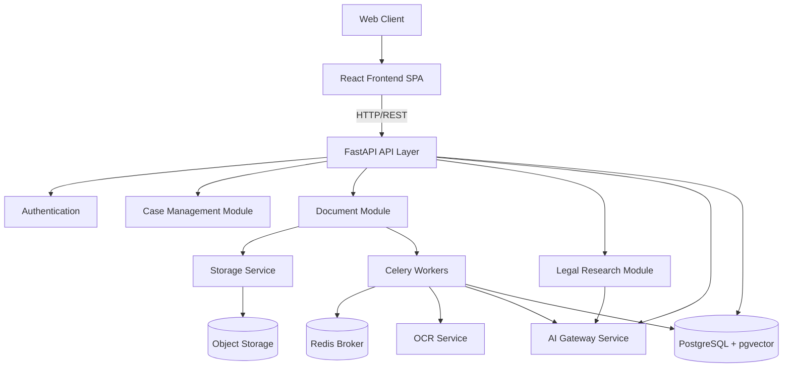

# JurisPulse Architecture

## Overview

JurisPulse is an advanced, multi-agent legal workflow orchestration platform designed for Indian legal professionals. This document outlines the architectural structure, principles, and technology stack powering the platform.

The architecture strictly follows Domain-Driven Design (DDD) principles where possible, cleanly separating infrastructure, application routing, business logic, and external services.

## Repository Structure

The project is structured as a monorepo containing frontend, backend, infrastructure configurations, and shared documentation.

```text
JurisPulse/
├── frontend/           # React Single Page Application (SPA)
├── backend/            # FastAPI Python server and workers
├── infrastructure/     # Deployment and container configurations
├── docs/               # System and API documentation
├── scripts/            # Build, deployment, and DB maintenance scripts
├── tests/              # End-to-end and integration tests
└── .github/            # CI/CD workflows and PR/Issue templates
```

## Frontend Architecture

The frontend is built using **React, TypeScript, Vite, and Tailwind CSS**, organized in a feature-oriented architecture.

### Key Directories

- `src/app/`: Application-level configurations, root router, layouts, and context providers.
- `src/components/`: Pure, reusable UI components (e.g., layouts, generic form fields).
- `src/design-system/`: Design tokens, themes, and base generic components.
- `src/features/`: Feature-sliced modules. Each feature folder (e.g., `cases`, `documents`, `research`, `auth`) is self-contained and encapsulates its own pages, components, and local hooks.
- `src/lib/`: Third-party library configurations and generic utilities.
- `src/services/`: API clients, network utilities, and data fetching definitions.
- `src/store/`: Global state management using Zustand (e.g., UI state, Auth state).

## Backend Architecture

The backend is built with **FastAPI** and orchestrates all data, AI processing, and task management. It employs a modular architecture designed to keep boundaries clean.

### Key Directories

- `backend/app/api/`: Central API router and common dependency injection.
- `backend/app/core/`: Core application configuration, settings, logging, and application lifecycle.
- `backend/app/database/`: SQLAlchemy database sessions, base models, and core repository patterns.
- `backend/app/modules/`: Business domain modules. Each module (e.g., `cases`, `auth`, `documents`) contains its own:
  - `models.py` (SQLAlchemy schemas)
  - `schemas.py` (Pydantic validation schemas)
  - `router.py` (API endpoints)
  - `service.py` (Business logic)
- `backend/app/services/`: Integration with external or standalone systems, including AI Gateways, OCR engines, and Storage providers.
- `backend/app/workers/`: Celery task definitions for background processing (e.g., document parsing).
- `backend/app/workflows/`: Complex multi-step business logic orchestrations.
- `backend/app/utils/`: Shared utilities like pagination and exception handling.

## Database Architecture

- **Primary Database**: PostgreSQL is used as the primary transactional database, with `pgvector` enabled for embedding storage and semantic search.
- **Migrations**: Alembic handles schema migrations (`backend/migrations/`).
- **Data Access**: Async SQLAlchemy (asyncpg) provides efficient, non-blocking I/O.

## AI Architecture

JurisPulse separates standard business logic from AI orchestration.
The AI Gateway (`backend/app/services/ai/`) acts as the proxy for specialized AI services (Drafting, Verification, Embeddings).

1. **AI Gateway**: Routes requests, handles fallbacks, and monitors AI service health.
2. **Drafting Service**: Generates legal text using LLMs.
3. **Verification Service**: Performs hallucination detection and cross-references generated text with actual case law.
4. **Agents**: Specialized AI agents (found in `backend/app/modules/agents/`) that handle multi-step workflows.

## Document Processing

1. **Upload**: Users upload documents which are saved to the storage backend (Supabase or Local).
2. **Task Queue**: A Celery worker is dispatched to process the file.
3. **Extraction**: The OCR pipeline extracts raw text.
4. **Chunking & Embedding**: The text is chunked and embedded via the AI Gateway.
5. **Storage**: Embeddings are stored in pgvector (`legal_chunks` table) for retrieval.

## OCR Pipeline

The OCR Pipeline (`backend/app/services/ocr/`) abstracts the underlying engine (Tesseract). It is configured to handle English and Hindi documents (`eng+hin`) at high resolution for optimal accuracy on scanned legal documents.

## Background Workers

- **Task Queue**: Celery handles long-running jobs (document processing, bulk email, analytics).
- **Broker & Backend**: Redis serves as both the message broker and the result backend.
- **Workers**: Code is located in `backend/app/workers/`.

## API Architecture

- Versioned at `/api/v1/`.
- Strict OpenAPI specification generated automatically.
- Global exception handling prevents stack-trace leakage.
- Enforced Rate Limiting and Request IDs for tracking.

## Authentication

- **Provider**: Handled via Supabase Auth and internal JWT mechanisms.
- **Role-Based Access Control (RBAC)**: Managed in the `roles` module. Users belong to `organizations` with specific permission levels.

## Infrastructure

- **Docker**: Containerized environments for both development and production.
- **Docker Compose**: Orchestrates the API, Database, Redis, and Celery workers locally.
- **Nginx**: Operates as a reverse proxy/gateway.

## Testing

- **Backend**: Pytest suite for unit and integration testing.
- **Frontend**: Vitest and React Testing Library.
- **Integration**: Tests mocking AI services and external APIs.

## Development Workflow

1. Check out a feature branch.
2. Develop locally using Docker or virtual environments.
3. Adhere to TypeScript strictness and Python type hinting (`mypy`).
4. PR validation via GitHub Actions (lint, build, test).

## Environment Configuration

Strict validation of environment variables via Pydantic `BaseSettings`. Secrets are injected dynamically and never hard-coded.

## Architectural Principles

1. **Correctness & Safety**: Never lose data. Never leak cross-tenant data.
2. **Maintainability**: Feature-sliced architecture ensures predictable file locations.
3. **Clarity**: Code should read like documentation. Complex workflows are mapped in the `workflows/` directory.
4. **Scalability**: Stateless API layer. Asynchronous worker pattern for heavy lifting.
5. **Aesthetics**: The frontend is built on a strict, modern design system to ensure a premium user experience.

---

### Architecture Diagram


