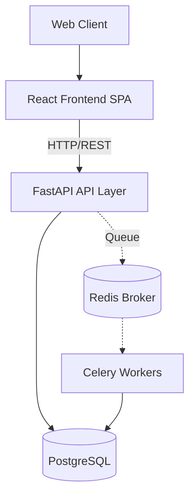

# JurisPulse Architecture

## Overview

JurisPulse is a legal workflow platform being built for Indian legal professionals. This document outlines the intended architectural structure and the current state of implementation.

The architecture aims to separate infrastructure, application routing, business logic, and external services cleanly.

## Current Repository Structure

The project is structured as a monorepo containing the frontend SPA and the Python backend.

```text
JurisPulse/
├── frontend/           # React Single Page Application (SPA) - scaffolded
├── backend/            # FastAPI Python application - scaffolded
├── infrastructure/     # Planned: Deployment and container configurations
├── docs/               # System and development documentation
├── scripts/            # Planned: Utility scripts
├── tests/              # Planned: Test suites
└── .github/            # GitHub metadata and workflows
```

## Current Implementation State

### Frontend Architecture (Current)

The frontend is initialized using **React 19, TypeScript, Vite, and Tailwind CSS**.

- **Routing:** Basic React Router setup.
- **State:** Zustand store initialized (`uiStore`).
- **Styling:** Tailwind CSS with a basic design system started.

### Backend Architecture (Current)

The backend is initialized using **FastAPI** with **SQLAlchemy**.

- **API:** Basic router wiring (`app/api/router.py`).
- **Database:** SQLAlchemy models defined for the core domains (Users, Cases, Organizations). Alembic migrations are configured.
- **Configuration:** Environment parsing via Pydantic `BaseSettings` (`app/core/config/`).
- **Dependencies:** Initial `requirements.txt` includes FastAPI, SQLAlchemy, Celery, Redis, and Supabase clients.

## Planned / Future Architecture

The following systems are currently scaffolded or planned but not yet fully implemented:

### AI & Document Processing (Planned)
- **AI Gateway**: A service to route requests to specialized AI models (Drafting, Verification, Embeddings).
- **OCR Pipeline**: Tesseract-based document extraction.
- **Vector Search**: Using `pgvector` for storing and retrieving legal document embeddings.

### Background Workers (Planned)
- **Celery & Redis**: For asynchronous tasks such as document processing and email notifications.

### Authentication (Planned)
- Integration with Supabase Auth and internal JWT handling for Role-Based Access Control (RBAC).

---

### Intended Architecture Diagram

*(Note: This represents the target architecture, parts of which are still under development.)*


