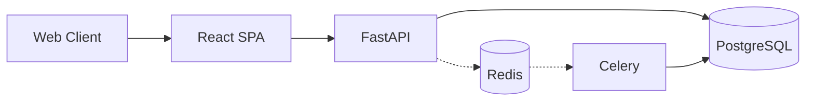

# JurisPulse

### Legal intelligence, in motion.

JurisPulse is a legal workflow platform built for the Indian legal ecosystem. It connects case management, physical document processing, and AI-assisted research into a single, cohesive interface.

**React** · **TypeScript** · **FastAPI** · **PostgreSQL** · **Celery** · **Redis**

[Architecture](./PROJECT_STRUCTURE.md) | [Documentation](./docs/development/)

---

## The Vision

JurisPulse is designed to solve a fundamental problem in Indian legal practice: fragmentation. Client communication, physical document parsing, and legal research typically occur across disconnected tools. 

JurisPulse brings these workflows into a unified, programmable environment.

### Product Overview

| Module | Purpose |
| --- | --- |
| **Case Intelligence** | Client management, case timelines, and automated hearing tracking. |
| **Document Intelligence** | Tesseract OCR ingestion, layout parsing, and semantic chunking. |
| **Legal Research** | pgvector-backed semantic search across historical case laws. |
| **AI Workflows** | LLM-assisted drafting and hallucination verification services. |

## Project Status

**Active development**

JurisPulse is currently in its initial structural phase. The core architecture is established, but feature implementation is ongoing.

### Current Implementation

- **Project Scaffold**: Monorepo structure properly segregating frontend and backend logic.
- **Database Architecture**: SQLAlchemy models for core domains (users, organizations, cases, documents) and Alembic migrations.
- **API Foundation**: Defined API routing structure grouped by domain modules.
- **Frontend Design System**: React application initialized with Vite, Tailwind CSS tokens, and a Zustand state store.

### Planned Capabilities

The following subsystems are designed and pending implementation:

- **Client & Case Timelines**: End-to-end case tracking and automated reminders.
- **OCR Ingestion Pipeline**: Processing physical documents via Tesseract and storing semantic chunks.
- **AI-Assisted Drafting**: Generating legal text securely using fine-tuned models.
- **Hallucination Detection**: Built-in verification cross-referencing AI output with established case laws.

## Architecture



The system is separated into three core domains:
- **Frontend Layer**: A React SPA handling UI state and data fetching.
- **API Layer**: A FastAPI application mapping business logic to specific REST endpoints.
- **Asynchronous Layer**: Celery workers polling Redis for heavy tasks like OCR.

## Technology

| Layer | Core Technologies |
|---|---|
| **Frontend** | React 19, TypeScript 6, Vite 8, Tailwind CSS |
| **Backend** | Python 3.11+, FastAPI, SQLAlchemy, Alembic |
| **Database** | PostgreSQL (Supabase / asyncpg), pgvector |
| **Async Workers** | Celery, Redis |

## Repository

```text
JurisPulse/
├── frontend/           # React SPA
├── backend/            # FastAPI application
├── infrastructure/     # Planned: Docker, Nginx, deployment
├── docs/               # System documentation
├── scripts/            # Planned: Utility scripts
├── tests/              # Planned: Test suites
└── .github/            # GitHub metadata
```

For a detailed breakdown of the internal architecture, see [PROJECT_STRUCTURE.md](./PROJECT_STRUCTURE.md).

## Getting Started

### Prerequisites
- **Node.js** (v18+)
- **Python** (3.11+)
- **PostgreSQL** (Local or Supabase)

### 1. Environment
```bash
cp backend/.env.example backend/.env
cp frontend/.env.example frontend/.env
```
Update `.env` files with your database credentials.

### 2. Backend API
```bash
cd backend
python -m venv .venv
source .venv/bin/activate  # Windows: .venv\Scripts\activate
pip install -r requirements.txt

# Run migrations and start server
alembic upgrade head
uvicorn app.main:app --reload --port 8000
```

### 3. Frontend SPA
```bash
cd frontend
npm install
npm run dev
```

## Testing

Run tests across the stack to ensure everything is working:

```bash
# Backend tests
pytest backend/tests/

# Frontend tests
npm run test --prefix frontend
```

## Contribution Guidelines

We welcome contributions! Please review our `docs/development` guides for coding standards and branching strategies. Open an issue to discuss major architectural changes before submitting a pull request.

## License

This project is proprietary and confidential. All rights reserved.
